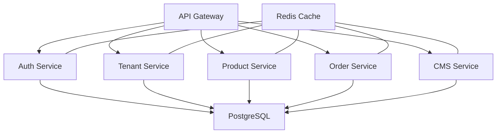

# Print-on-Demand Platform Architecture Design

## System Overview

The Print-on-Demand Platform is designed as a scalable, multi-tenant system built on modern web technologies. The architecture emphasizes security, performance, and maintainability while supporting white-label customization and tiered feature access.

## Core Architecture Components

### 1. Frontend Architecture

#### Technology Stack
- React 18+ with TypeScript
- Vite for build tooling
- Redux Toolkit for state management
- Tailwind CSS for styling
- React Query for data fetching

#### Component Structure
```
src/
├── components/         # Shared UI components
├── features/          # Feature-specific modules
├── hooks/             # Custom React hooks
├── services/          # API and external service integration
└── utils/            # Shared utilities
```

### 2. Backend Architecture

#### Multi-Tenant Design
- Each tenant gets isolated database schema
- Shared infrastructure with logical separation
- Tenant-specific configuration and customization
- Resource usage monitoring and quotas

#### Security Layer
```typescript
interface SecurityConfig {
  authentication: {
    oauth: {
      providers: ['google', 'github', 'custom'];
      mfa: boolean;
    };
    rbac: {
      roles: ['admin', 'manager', 'user'];
      permissions: Record<string, string[]>;
    };
  };
  encryption: {
    atRest: 'AES-256';
    inTransit: 'TLS-1.3';
  };
}
```

### 3. Database Design

#### Core Tables
```sql
-- Tenant Management
CREATE TABLE tenants (
    id UUID PRIMARY KEY,
    name VARCHAR(255),
    domain VARCHAR(255),
    tier VARCHAR(50),
    settings JSONB,
    created_at TIMESTAMPTZ DEFAULT NOW(),
    updated_at TIMESTAMPTZ DEFAULT NOW()
);

-- User Management
CREATE TABLE users (
    id UUID PRIMARY KEY,
    tenant_id UUID REFERENCES tenants(id),
    email VARCHAR(255),
    role VARCHAR(50),
    settings JSONB,
    created_at TIMESTAMPTZ DEFAULT NOW()
);

-- Products
CREATE TABLE products (
    id UUID PRIMARY KEY,
    tenant_id UUID REFERENCES tenants(id),
    name VARCHAR(255),
    description TEXT,
    variants JSONB,
    pricing JSONB,
    metadata JSONB,
    created_at TIMESTAMPTZ DEFAULT NOW(),
    updated_at TIMESTAMPTZ DEFAULT NOW()
);

-- Orders
CREATE TABLE orders (
    id UUID PRIMARY KEY,
    tenant_id UUID REFERENCES tenants(id),
    user_id UUID REFERENCES users(id),
    status VARCHAR(50),
    items JSONB,
    shipping_info JSONB,
    payment_info JSONB,
    created_at TIMESTAMPTZ DEFAULT NOW(),
    updated_at TIMESTAMPTZ DEFAULT NOW()
);
```

### 4. Service Architecture

#### Microservices Design


### 5. Integration Architecture

#### Print Provider Integration
```typescript
interface PrintProvider {
  name: string;
  api: {
    endpoint: string;
    version: string;
    authentication: {
      type: 'oauth2' | 'apiKey';
      credentials: Record<string, string>;
    };
  };
  capabilities: {
    products: string[];
    printAreas: Array<{
      name: string;
      dimensions: {
        width: number;
        height: number;
        unit: string;
      };
    }>;
    shipping: {
      methods: string[];
      zones: string[];
    };
  };
}
```

### 6. Caching Strategy

#### Redis Implementation
```typescript
interface CacheConfig {
  layers: {
    application: {
      engine: 'Redis';
      ttl: number;
      invalidation: 'LRU';
    };
    session: {
      engine: 'Redis';
      ttl: number;
      persistence: boolean;
    };
    cdn: {
      provider: 'Cloudflare';
      regions: string[];
    };
  };
}
```

### 7. Monitoring and Analytics

#### Telemetry Structure
```typescript
interface Telemetry {
  metrics: {
    system: {
      cpu: number;
      memory: number;
      disk: number;
    };
    application: {
      responseTime: number;
      errorRate: number;
      activeUsers: number;
    };
    business: {
      ordersPerHour: number;
      revenuePerDay: number;
      activeDesigns: number;
    };
  };
}
```

## Deployment Architecture

### Kubernetes Configuration
```yaml
apiVersion: apps/v1
kind: Deployment
metadata:
  name: pod-platform
spec:
  replicas: 3
  selector:
    matchLabels:
      app: pod-platform
  template:
    metadata:
      labels:
        app: pod-platform
    spec:
      containers:
      - name: frontend
        image: pod-platform/frontend:latest
        resources:
          limits:
            memory: "512Mi"
            cpu: "500m"
      - name: api
        image: pod-platform/api:latest
        resources:
          limits:
            memory: "1Gi"
            cpu: "1000m"
```

## Security Implementation

### Authentication Flow
1. OAuth 2.0 provider authentication
2. JWT token generation with tenant context
3. Role-based access control validation
4. Multi-factor authentication when required
5. Session management with Redis

### Data Protection
- Encryption at rest using AES-256
- TLS 1.3 for data in transit
- Regular security audits
- Automated vulnerability scanning

## Scalability Considerations

### Horizontal Scaling
- Stateless application design
- Load balancing across regions
- Database read replicas
- CDN integration for static assets

### Vertical Scaling
- Resource allocation per tenant
- Database connection pooling
- Cache optimization
- Query performance tuning

## Development Guidelines

### Code Standards
```typescript
// Example component structure
interface Props {
  tenant: TenantConfig;
  user: UserProfile;
  permissions: string[];
}

const ProductDesigner: React.FC<Props> = ({
  tenant,
  user,
  permissions
}) => {
  // Implementation
};
```

### Testing Strategy
- Unit tests for business logic
- Integration tests for API endpoints
- E2E tests for critical flows
- Performance testing for scalability

## Maintenance Procedures

### Deployment Process
1. Automated testing in CI/CD pipeline
2. Staged rollout to production
3. Monitoring for anomalies
4. Rollback procedures if needed

### Backup Strategy
- Daily database backups
- File system snapshots
- Configuration version control
- Disaster recovery planning